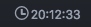

# ticker

Display a simple clock in the status bar.

### Installation
The clock can be installed through Atom.  Select Preferences > Install and search for the Ticker package

### Features
* Customizable time format to view time in 24 hour format or military format

### Contributing
**Want to help create ticker features?** Please, feel free to fork this repository, and make any change you like. If you
want to propose a nice feature, please create a separate branch on your fork,
named after the feature you want to implement, then make a pull request from that
branch.

**To-do features**
* Finish feature for converting from 24 hour format to military format
* Add customization of clock icon
* Add ability to display UTC time instead of local time
